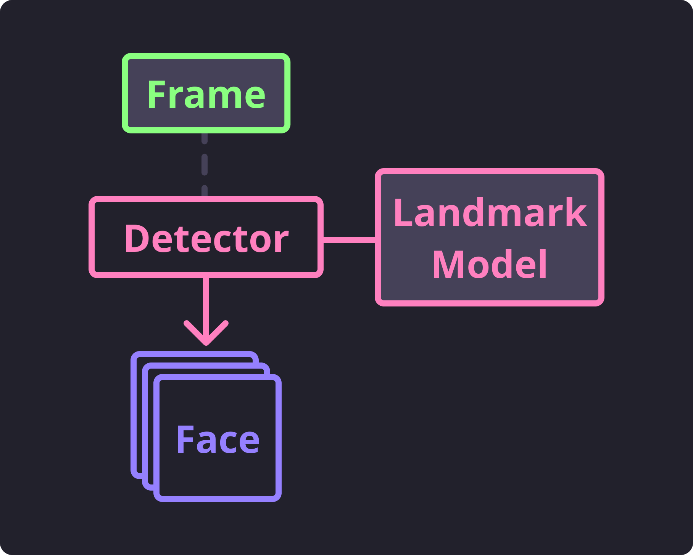

Detecting Faces
===============

Now onto the fun part.
Face feature detection is powered by good ol' dlib_.
As part of this package, we have bundled 3 pre-trained landmark models for face features
each detecting various different face landmarks.
The face features (interchangeably termed landmarks) we are able to detect are
classified in the :class:`~.types.FaceFeature` enumeration.

The included landmark models are programmatically provided through the following
:class:`~.detect.BaseLandmarkDetector` subclasses:

- :class:`~.detect.BasicFaceDetector`
- :class:`~.detect.PartialFaceDetector`
- :class:`~.detect.FullFaceDetector`

Although each of these detectors operates *essentially* the same way, they produce
different results and have various caveats that you would benefit from knowing.
We will be covering the ins and outs of each of these detectors in the following related
sections.

But first, a few helpful details on how subclasses of
:class:`~.detect.BaseLandmarkDetector` work.
Each subclass will contain a reference to a file location where the trained landmark
model exists.
Upon instantiation of the subclass, that model will be open and read into memory
**which can take longer than a second in some cases** (given the size of the model).

.. code-block:: python
   :linenos:

   from facelift.detect import BasicFaceDetector
   BasicFaceDetector.model_filepath  # filepath to the related trained landmark model
   detector = BasicFaceDetector()    # trained model is opened and loaded into memory

Each instance of these subclass comes with a helpful little generator that will produce
instances of :class:`~.types.Face` for a given :attr:`~.types.Frame`.
This generator is called :meth:`~.detect.BaseLandmarkDetector.iter_faces` and will
utilize the loaded model to handle feature detection ✨ automagically ✨.

.. code-block:: python
   :linenos:

   from facelift.types import Face
   from facelift.capture import iter_stream_frames
   from facelift.detect import BasicFaceDetector

   detector = BasicFaceDetector()
   for frame in iter_stream_frames():
       for face in detector.iter_faces(frame):
           assert isinstance(face, Face)

Each generated face represents a single set of face landmarks detected from the given
frame.
The accuracy of this detection is wholely the responsibility of the trained model
(although you can typically benefit it by transforming the frame into an optimal state
before attempting to perform detection).

   Detect Flow

If you are finding that the bundled face landmark models are not as accurate as you
require, you should look further into training your own landmark models for dlib_.
**Note that this is not a trivial task.**

.. tip::
   The :meth:`~.detect.BaseLandmarkDetector.iter_faces` generator comes with a parameter
   called ``upsample`` that is defaulted to ``0``.
   If you are having to detect faces from **really** small frames, setting this
   parameter to a positive value will attempt to optimally upsample the frame using
   dlib_'s builtin utilities.

   .. code-block:: python
      :linenos:

      for frame in iter_stream_frames():
          for face in detector.iter_faces(frame, upsample=2):
              assert isinstance(face, Face)

   Be cautious about using this feature with large frames as it will drastically
   increase the amount of time that is necessary to detect faces.
   I would recommend avoiding using this feature when processing multiple frames (either
   from videos or streams).

Basic Face Detection
--------------------

The basic face detector is the lightest weight detector and likely should be used for
when you need to simply detect faces or recognize faces.
Faces detected with this detector contain a single point for three face features:

- :attr:`~.types.FaceFeature.LEFT_EYE` - A single point on the outside of the left eye
- :attr:`~.types.FaceFeature.RIGHT_EYE` - A single point on the outside of the right eye
- :attr:`~.types.FaceFeature.NOSE` - A single point right below the nose

Checkout the following recording of the below script for a better understanding of what
points are detected.

.. code-block:: python
   :linenos:

   from facelift.capture import iter_stream_frames
   from facelift.detect import BasicFaceDetector
   from facelift.window import opencv_window
   from facelift.render import draw_points

   detector = BasicFaceDetector()
   with opencv_window() as window:
       for frame in iter_stream_frames():
           for face in detector.iter_faces(frame):
               for _, points in face.landmarks.items():
                   # big colorful points so you can see what's going on
                   frame = draw_points(frame, points, size=3, color=(0, 255, 0))

           window.render(frame)

.. raw:: html

   <video style="width:100%;" controls>
      <source src="../_static/assets/recordings/basic_face_detector.mp4" type="video/mp4">
   </video>

Because the features we are detecting are just single points, we really can't do much to
determine a face's state (such as if eyes are opened or closed).
However, we can determine where a face is placed and what angle the face is tilted
within the frame.
This is particularly helpful as we usually want to extract normalized frames with a
properly positioned face for more accurate face recognition.

As an example of this, we have included the :mod:`~.helpers` module with some examples
of basic face positioning math to extract frames where the face is always centered and
angled correctly.
The helper function that provides this appropriate face positioning functionality is
:func:`~.helpers.get_normalized_frame`.
You can use it by simply passing both the starting frame and a detected face:

.. code-block:: python
   :linenos:

   from facelift.capture import iter_stream_frames
   from facelift.detect import BasicFaceDetector
   from facelift.window import opencv_window
   from facelift.helpers import get_normalized_frame

   detector = BasicFaceDetector()
   with opencv_window() as window:
       for frame in iter_stream_frames():
           for face in detector.iter_faces(frame):
               frame = get_normalized_frame(frame, face)

           window.render(frame)

.. raw:: html

   <video style="width:100%;" controls>
      <source src="../_static/assets/recordings/get_normalized_frame.mp4" type="video/mp4">
   </video>

Overall, the :class:`~.detect.BasicFaceDetector` is useful for quick face detection
where your only desire is to extract a face from a frame.

Partial Face Detection
-----------------------

The :class:`~.detect.PartialFaceDetector` uses the heaviest of the three landmark models
(likely since it was trained the most rigorously of the three).
This detector detects all face features **except** for the
:attr:`~.types.FaceFeature.FOREHEAD` feature.
Each detected feature is a :class:`~.types.PointSequence` and can be used to render
the outline of the detected face.

.. code-block:: python
   :linenos:

   from facelift.capture import iter_stream_frames
   from facelift.detect import PartialFaceDetector
   from facelift.window import opencv_window
   from facelift.render import draw_points

   detector = PartialFaceDetector()
   with opencv_window() as window:
       for frame in iter_stream_frames():
           for face in detector.iter_faces(frame):
               for _, points in face.landmarks.items():
                   frame = draw_points(frame, points, color=(0, 255, 0))

           window.render(frame)

.. raw:: html

   <video style="width:100%;" controls>
      <source src="../_static/assets/recordings/partial_face_detector.mp4" type="video/mp4">
   </video>

Because this detector is discovering multiple points for a single face feature, we can
use these points to actually build a pretty good representation of the face.

Full Face Detection
-------------------

The :class:`~.detect.FullFaceDetector` is a third-party trained model that includes
detection of all :class:`~.types.FaceFeature` features.
With the addition of the :attr:`~.types.FaceFeature.FOREHEAD` feature, we can also
include the curvature and angle of the forehead.

.. code-block:: python
   :linenos:

   from facelift.capture import iter_stream_frames
   from facelift.detect import FullFaceDetector
   from facelift.window import opencv_window
   from facelift.render import draw_points

   detector = FullFaceDetector()
   with opencv_window() as window:
       for frame in iter_stream_frames():
           for face in detector.iter_faces(frame):
               for _, points in face.landmarks.items():
                   frame = draw_points(frame, points, color=(0, 255, 0))

           window.render(frame)

.. raw:: html

   <video style="width:100%;" controls>
      <source src="../_static/assets/recordings/full_face_detector.mp4" type="video/mp4">
   </video>

The included model is not as heavily trained as the
:class:`~.detect.PartialFaceDetector` so you may see some inconsistencies between the
two detectors.
Regardless, with the inclusion of the :attr:`~.types.FaceFeature.FOREHEAD` feature, you
get another dimension to work with that may be valuable for your use case.
