Drawing on Frames
=================

We've included a few drawing features are just quick and easy to use wrappers for some
of the builtin drawing functionality OpenCV provides by default.
These helper functions are found in the :mod:`~.render` module.
The original reason we added these drawing helpers in was to make it easier to debug
what is being detected.

As these drawing features are already common to OpenCV, we will give just a quick
overview of what is available in this package.
For a more full description of the available parameters and constants, you should just
read through the :mod:`~.render` module auto-generated documentation.

Points
------

Drawing points is really simple.
If you have a single point either as an ``(x, y)`` tuple or a :attr:`~.types.Point`
that you want to render you can use :func:`~.render.draw_point`.

.. code-block:: python
   :linenos:

   from facelift.render import draw_point
   frame = numpy.zeros((512, 512, 3))
   frame = draw_point(frame, (64, 64), size=4)

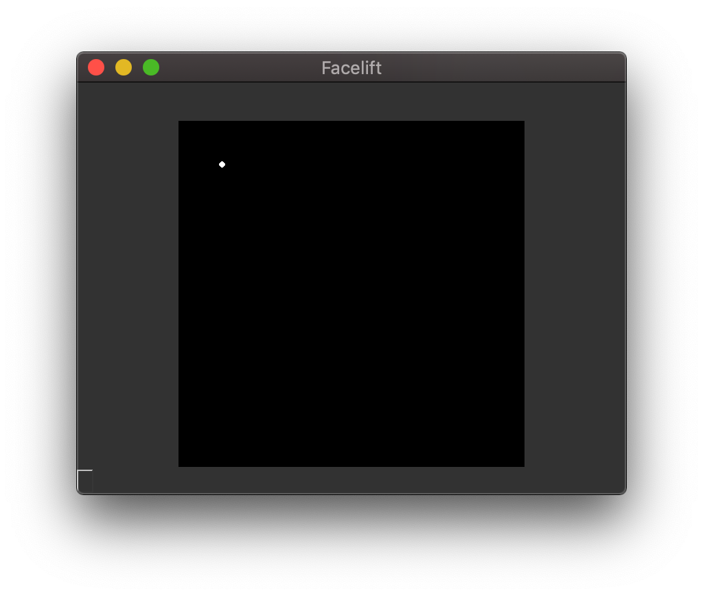

   Drawing a single point

We also provide a shorthand function for rendering either a list of ``(x, y)`` tuples or
an :attr:`~.types.PointSequence` called :func:`~.render.draw_points`.

.. code-block:: python
   :linenos:

   from facelift.render import draw_points
   frame = numpy.zeros((512, 512, 3))
   frame = draw_point(frame, [(64, 64), (128, 128), (256, 256)], size=4)

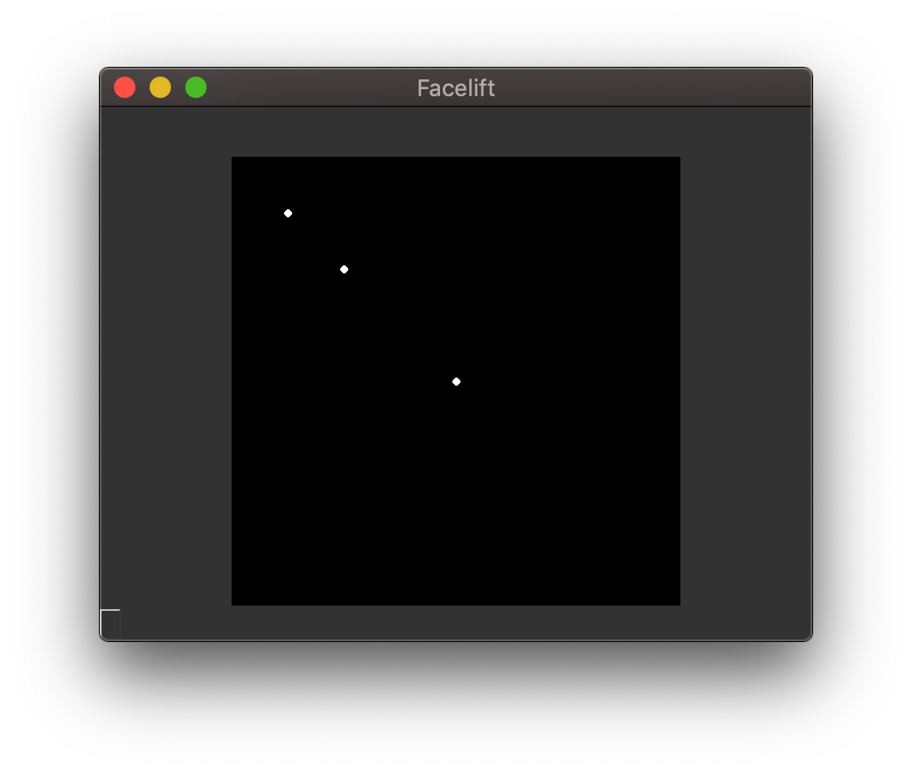

   Drawing multiple points

Lines
-----

If you have a list of ``(x, y)`` tuples or an :attr:`~.types.PointSequence` and you wish
to draw a connected line between the points, you can use the :func:`~.render.draw_line`
function.

.. code-block:: python
   :linenos:

   from facelift.render import draw_line
   frame = numpy.zeros((512, 512, 3))
   frame = draw_line(frame, [(64, 64), (128, 128), (256, 256)], thickness=4)

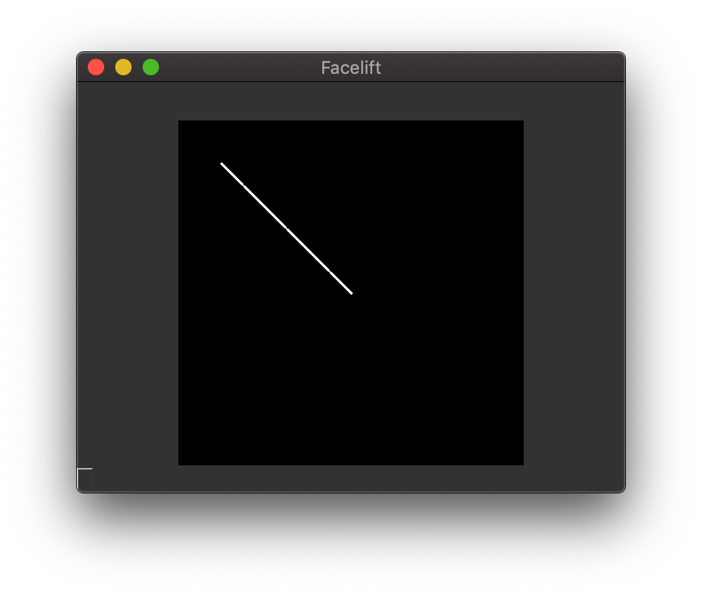

   Drawing a line

Shapes
------

Instead of having to use a combination of just points and lines to draw everything, we
have a few other functions that provide basic shape drawing.
These are still mostly all just wrappers around the default functionality that OpenCV
provides.

Rectangles
~~~~~~~~~~

Drawing rectangles is as simple as providing top-left and bottom-right points to draw
the rectangle between.

.. code-block:: python
   :linenos:

   from facelift.render import draw_points
   frame = numpy.zeros((512, 512, 3))
   frame = draw_point(frame, (64, 64), (256, 256), thickness=2)

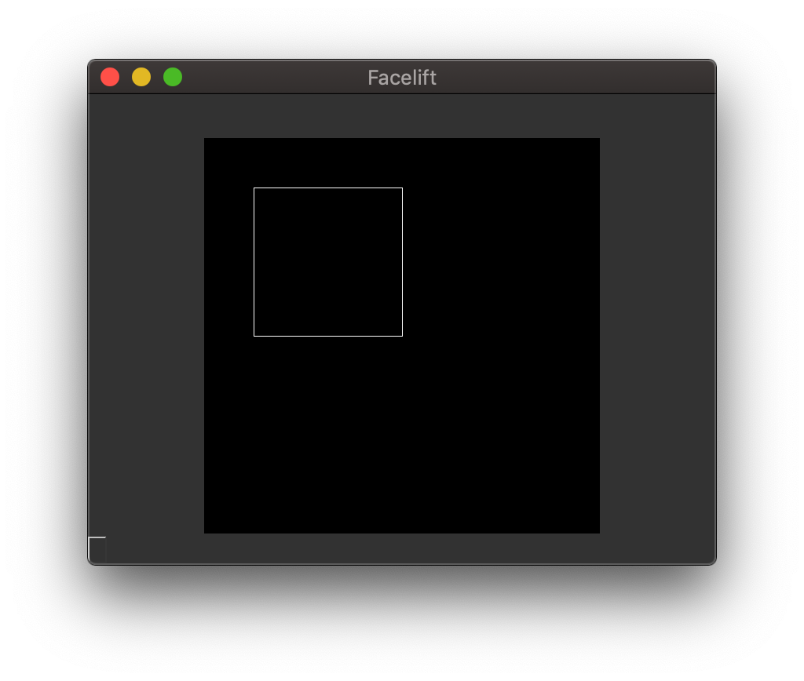

   Drawing a rectangle

Circles
~~~~~~~

Circles are just points with a non-negative thickness.
So to draw a circle we can utilize the included :func:`~.render.draw_point` and supply
*at-least* a thickness of ``0``.

.. code-block:: python
   :linenos:

   from facelift.render import draw_point
   frame = numpy.zeros((512, 512, 3))
   frame = draw_point(frame, (64, 64), size=32, thickness=0)

You will probably also want to adjust the ``size`` of the point as a small enough point
will always appear filled rather than as a circle.

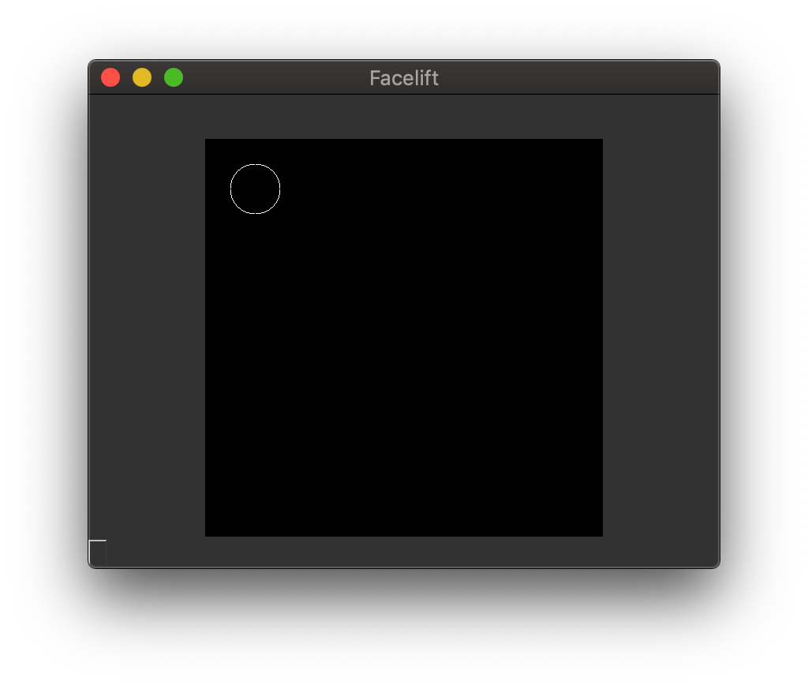

   Drawing a circle

Contours
~~~~~~~~

If you want to use an :attr:`~.types.PointSequence` as the outline for a shape, you can
use the :func:`~.render.draw_contour` function.

.. code-block:: python
   :linenos:

   from facelift.render import draw_contour
   frame = numpy.zeros((512, 512, 3))
   frame = draw_contour(frame, [(64, 64), (128, 128), (256, 256), (64, 256)])

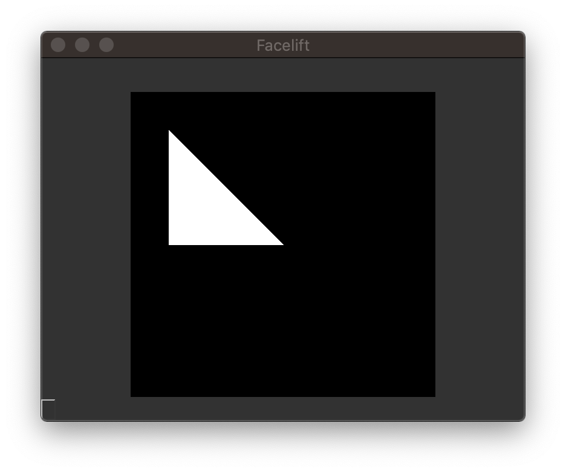

   Drawing a triangle

Text
----

Drawing text is a *bit* more complicated than the other helper functions.
Rather than have to do some messy calls to determine width and height of specific fonts
to render text in the appropriate location, we handle drawing text by first defining a
bounding box for the text to be positioned in.
Since it is **much** easier to place a rectangle, drawing text within that rectangle's
bounds is much easier in turn.
This is all handled by the :func:`~.render.draw_text` function.

.. code-block:: python
   :linenos:

   from facelift.render import draw_rectangle, draw_text
   frame = numpy.zeros((512, 512, 3))
   frame = draw_rectangle(frame, (64, 64), (448, 256), color=(0, 0, 255))
   frame = draw_text(frame, "Hello, World!", (64, 64), (448, 256))

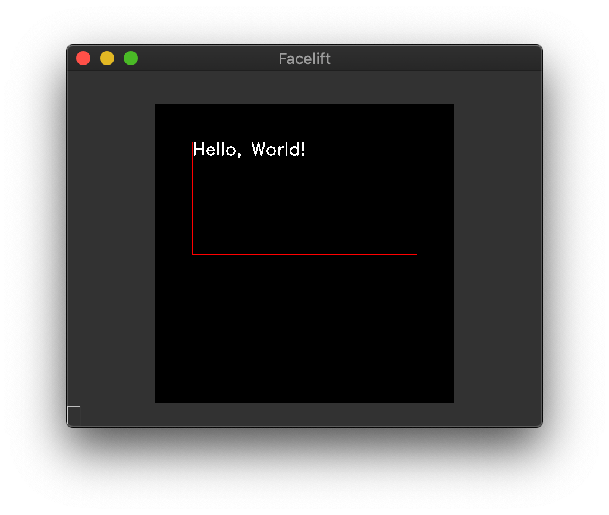

   Default aligned text

You can utilize the :class:`~.render.Position` enumeration to position the text within
this bounding box.
For example, if we wanted to center the text we can set both the ``x_position`` and
``y_position`` to :attr:`~.render.Position.CENTER`.

.. code-block:: python
   :linenos:

   from facelift.render import draw_rectangle, draw_text, Position
   frame = numpy.zeros((512, 512, 3))
   draw_rectangle(frame, (64, 64), (448, 256), color=(0, 0, 255))
   frame = draw_text(
       frame,
       "Hello, World!",
       (64, 64), (448, 256),
       x_position=Position.CENTER,
       y_position=Position.CENTER
   )

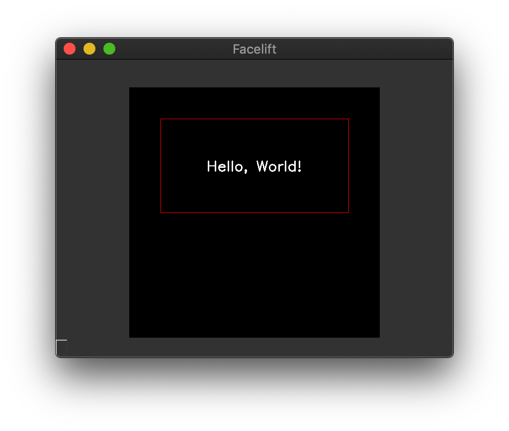

   Center aligned text

Similarly you can set both to :attr:`~.render.Position.END` to place the text at the
lower left corner of the text container.

.. code-block:: python
   :linenos:

   from facelift.render import draw_rectangle, draw_text, Position
   frame = numpy.zeros((512, 512, 3))
   draw_rectangle(frame, (64, 64), (448, 256), color=(0, 0, 255))
   frame = draw_text(
       frame,
       "Hello, World!",
       (64, 64), (448, 256),
       x_position=Position.END,
       y_position=Position.END
   )

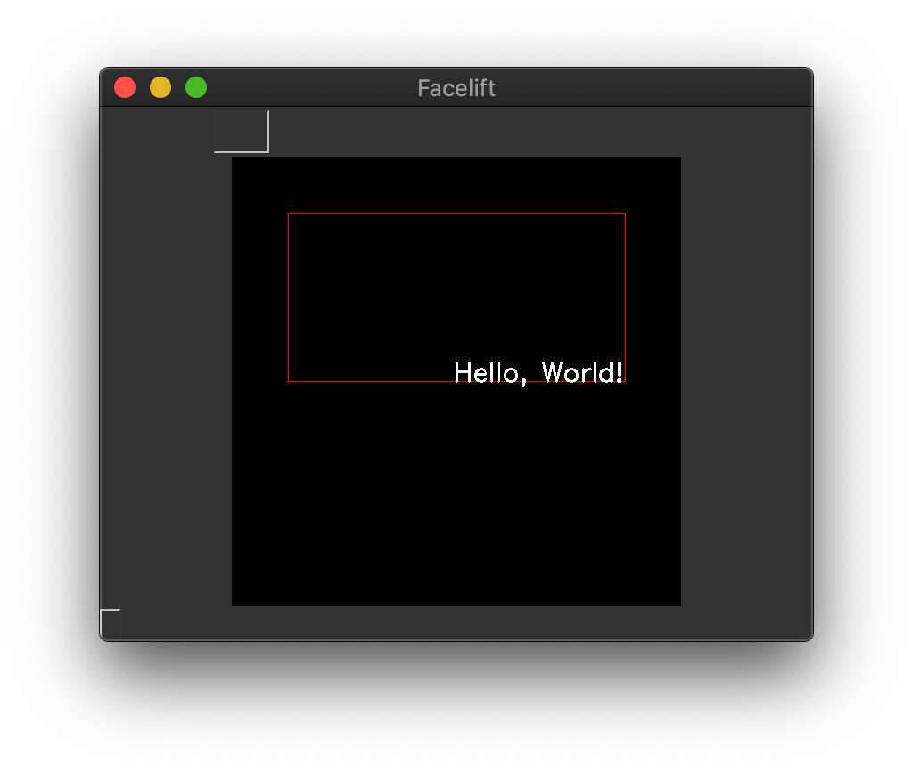

   End aligned text

Container Overflow
~~~~~~~~~~~~~~~~~~

If you don't actually want to utilize the bounding box as a container, and instead want
to use it as basically just a big reference to start OpenCV's default text drawing, you
can set ``allow_overflow`` to ``True``.

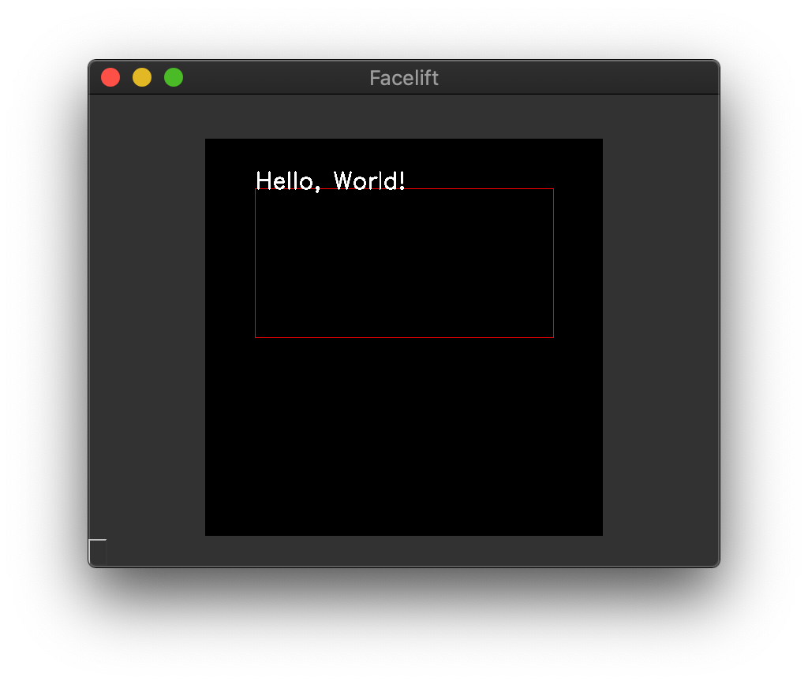

   Default aligned text with ``allow_overflow=True``

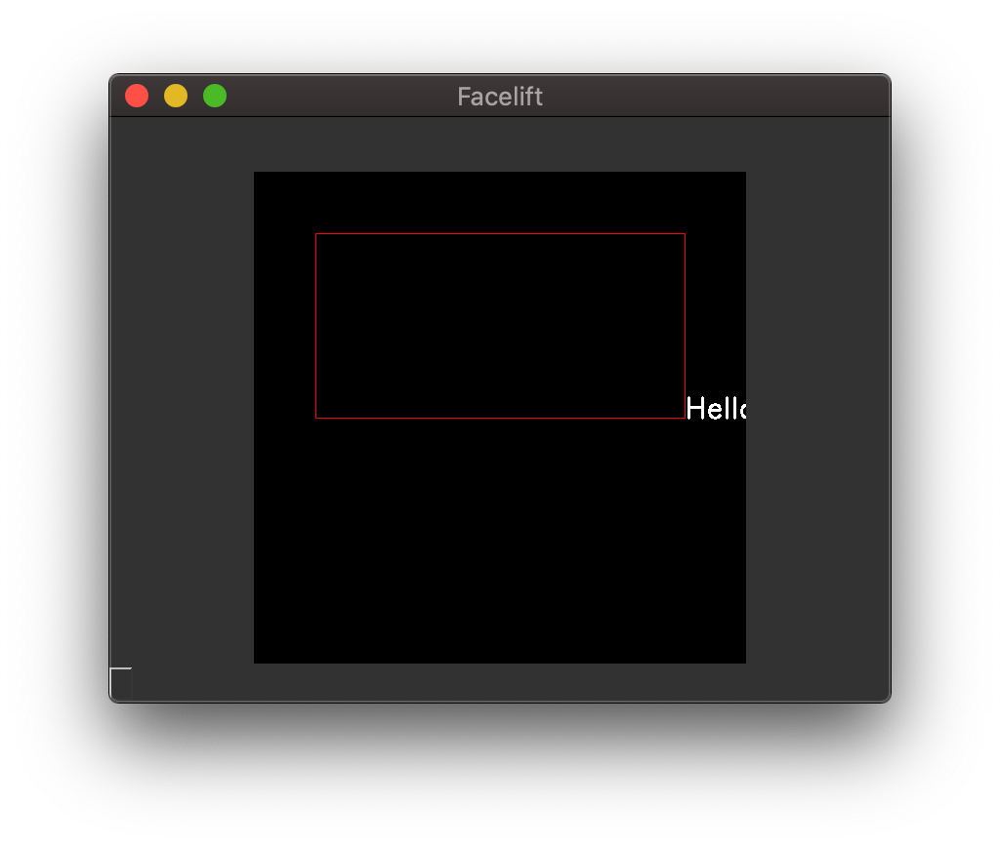

   End aligned text with ``allow_overflow=True``

.. warning::
   We are not being clever enough here to handle any kind of text wrapping for the
   bounding container that you define.
   This container is really only used to determine where to **start** drawing your text
   rather than keeping it all within a box.

   If your text size is larger than the defined bounding container, it will overflow
   (likely on the x-axis).
