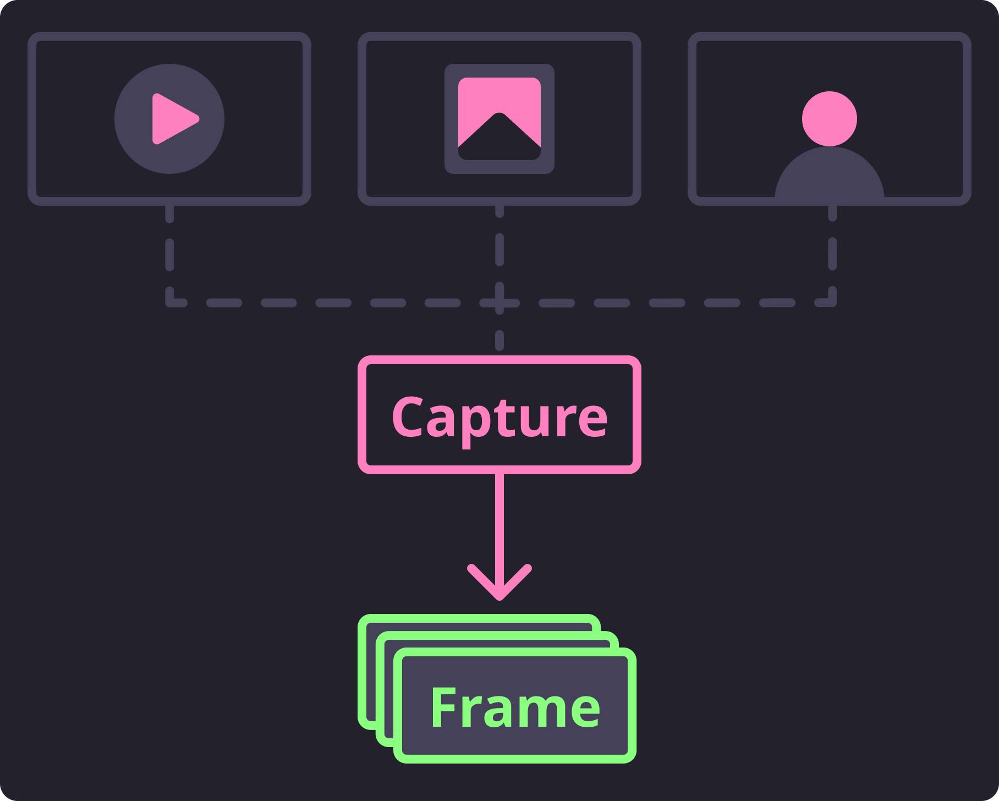

Reading Frames
==============

Likely you already have some kind of content you want to detect faces from.
Whether that be a picture, a video, or your webcam, we need to be able to capture the
frames from that media so we can use them for processing.
These content types that we typically want to extract frames from are defined in
:class:`~.types.MediaType`.

.. autoclass:: facelift.types.MediaType
   :noindex:

If processing a media file (such as an image or a video) these media types are
automatically discovered from some magic methods available in the :mod:`~.magic` module.
There, we attempt to make a best guess at what type of content you are attempting to
capture frames from.

   >>> from facelift.types import MediaType
   >>> from facelift.magic import get_media_type
   >>> media_type = get_media_type(Path("~/my-video.mp4"))
   >>> assert media_type == MediaType.VIDEO

Actually opening and reading frames from content is typically performed using a mix of
OpenCV functions that use completel different syntax for each of these types of media.
For most all use cases we really shouldn't care about the differences of how
OpenCV opens, processes, and closes media.
So we reduced the mental overhead of this process a bit and namespaced it within the
:mod:`~.capture` module.

   This module's overall purpose is to effeciently encapsulate the OpenCV calls
   necessary to capture the frames from the given media.

   Basic Capture Flow

To do this we have exposed separate generator functions.
One for handling written media files, and another for handling streamed frames.
We made the decision to keep these generators separate as they have distinct features
that would make a single generator function less explicit and intuitive.

Capturing Media Frames
----------------------

To read frames from existing media files (either images or videos) you can utilize the
:func:`~.capture.iter_media_frames` generator to extract sequential frames.
This function takes a :class:`pathlib.Path` instance and will build the appropriate
generator to capture and iterate over the available frames one at a time.

.. code-block:: python
   :linenos:

   from facelift.capture import iter_media_frames
   from facelift.types import Frame

   for frame in iter_media_frames(Path("~/my-video.mp4")):
      assert isinstance(frame, Frame)

If you would like to loop over the available frames, the ``loop`` boolean flag can be
set to ``True``.
This flag will seek to the starting frame automatically once all frames have been read
essentially restarting the generator.
This means that you will need to break out of the generator yourself as it will produce
an infinite loop.

.. code-block:: python
  :linenos:

  for frame in iter_media_frames(Path("~/my-video.mp4"), loop=True):
      assert isinstance(frame, Frame)

Capturing Stream Frames
-----------------------

To read frames from a stream (such as a webcam) you can utilize the very similar
:func:`~.capture.iter_stream_frames` generator to extract the streaming frames.
This function will scan for the first available active webcam to stream frames from.

.. code-block:: python
  :linenos:

  from facelift.capture import iter_stream_frames
  from facelift.types import Frame

  for frame in iter_stream_frames():
      assert isinstance(frame, Frame)

If you happen to have 2 webcams available, you can pick what webcam to stream frames
from by using the indexes (0-99).
For example, if you wanted to stream frames from the second available webcam,
simply pass in index ``1`` to the generator:

.. code-block:: python
  :linenos:

  for frame in iter_stream_frames(1):
      assert isinstance(frame, Frame)

.. important::
  When capturing streamed frames, this generator will not stop until the device stream
  is halted.
  Typically, when processing stream frames, you should build in a mechanism to break out
  of the capture loop when desireable.

  In most of the below examples I will simply be raising :class:`KeyboardInterrupt` to
  break out of this loop.
  You will likely want to add some kind of break conditional to this loop in your usage.
