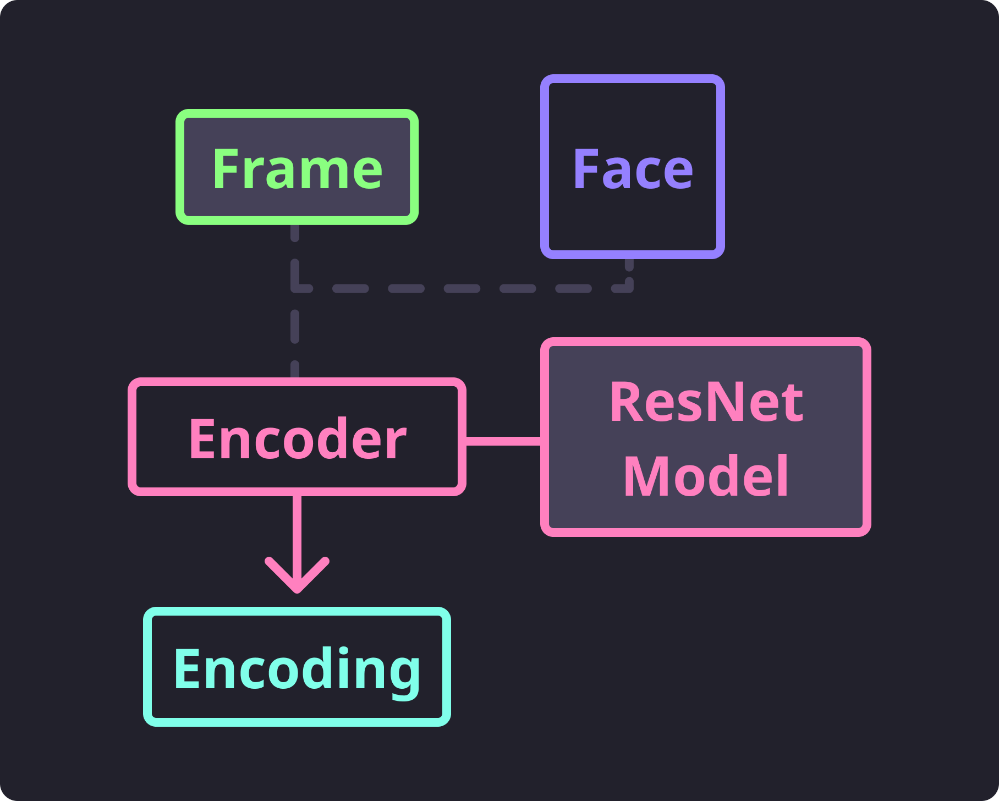

Recognizing Faces
=================

Recognition is performed by producing an :attr:`~.types.Encoding` for a detected face.
This encoding is just an array of dimensions that *should* be pretty unique for that
person's face.
The encoding itself is produced by yet another bundled pre-trained model produced by
dlib_.
This model is a ResNet_ model trained for producing identifiers for images of faces.
There are other trained models for producing identifiers for detected faces, however we
are only bundling the one produced and used by dlib_.

Encoding Faces
--------------

Similar to how we handle face detection, we also provide a
:class:`~.encode.BasicFaceEncoder` from the :mod:`~.encode` module.
This encoder provides a method :meth:`~.encode.BasicFaceEncoder.get_encoding` which
will take a given frame and a face detected within that frame to produce an
:attr:`~.types.Encoding` for the face.

   Encode Flow

You can quickly get a face's encoding from a script similar to the following:

.. code-block:: python
   :linenos:

   from pathlib import Path
   from facelift.encode import BasicFaceEncoder
   from facelift.detect import BasicFaceDetector
   from facelift.capture import iter_media_frames

   detector = BasicFaceDetector()
   encoder = BasicFaceEncoder()

   frame = next(iter_media_frames(Path("~/my-profile-picture.jpeg")))
   face = next(detector.iter_faces(frame))
   face_encoding = encoder.get_encoding(frame, face)

You will note that the name :class:`~.encode.BasicFaceEncoder` is very similar to
:class:`~.detect.BasicFaceDetector`.
This is to hopefully encourage developer's intuition to use these two classes together
when performing face recognition.

.. important::
   Face recognition with the :class:`~.encode.BasicFaceEncoder` **will not work** from
   faces detected using the :class:`~.detect.FullFaceDetector`.

   Although you can use faces detected from both the
   :class:`~.detect.BasicFaceDetector` and :class:`~.detect.PartialFaceDetector` to get
   encodings from this :class:`~.encode.BasicFaceEncoder`,
   **you should always prefer using lighter weight detector to avoid slowdown.**

This module **does not** provide any kind of features for storing these produced
encodings; that is completely up to the implementation you are building.
You will need to find a way to store the produced encodings associated to an identifier
(such as the persons name).
For example, you could really simply store the encoding directly associated with the
person's name by using a dictionary such as the following:

.. code-block:: python
   :linenos:

   face_encoding = encoder.get_encoding(frame, face)
   face_storage = {
      "Stephen Bunn": [face_encoding]
   }

Remember that each encoding is an instance of a :class:`numpy.ndarray` which isn't
immediately JSON serializable.
However, they can be converted to more common types or can be stored using :mod:`pickle`
or something more advanced.

Scoring Encodings
-----------------

We haven't yet actually performed any recognition yet.
But now that we have some registered encodings, we can start taking newly detected faces
and score them against our known face encodings to get a good idea whose face we are
detecting.
This scoring is provided by the :meth:`~.encode.BaseEncoder.score_encoding` method
which takes an unknown face encoding and a list of known faces for a **single** person
to see how similar they are.
The closer the score is to ``0.0``, the more likely that face encoding is the same as
those described in the list of known encodings.

.. code-block:: python
   :linenos:

   known_encodings = [...]
   score = encoder.score_encoding(face_encoding, known_encodings)

Note that ``known_encodings`` takes a list of encodings rather than a single encoding.
This list of encodings should always be encodings of the same person.
If you start passing in various encodings from different people, the produced score
won't make any sense.

   Score Flow

It's probably easier to show what some very basic face recognition looks like.
Below is an example of some stored face encodings, a few of myself and a few of
`Terry Crews <https://en.wikipedia.org/wiki/Terry_Crews>`_.
The following script will iterate over the stored face encodings and determine
the best fit for each detected face my webcam stream.

.. code-block:: python
   :linenos:

   from facelift.capture import iter_stream_frames
   from facelift.window import opencv_window
   from facelift.draw import draw_text
   from facelift.detect import BasicFaceDetector
   from facelift.encode import BasicFaceEncoder

   detector = BasicFaceDetector()
   encoder = BasicFaceEncoder()

   # known encodings for specific faces
   # trimmed out the actual encodings to preserve some readability
   face_storage = {
      "Stephen Bunn": [...],
      "Terry Crews": [...]
   }

   with opencv_window() as window:
       for frame in iter_stream_frames():
           for face in detector.iter_faces(frame):
               face_encoding = encoder.get_encoding(frame, face)

               # collect scores for our storage of known encodings
               # this could be further optimized using multi-threading or better
               # storage mechanisms
               scores = []
               for name, known_encodings in face_storage.items():
                   score = encoder.score_encoding(face_encoding, known_encodings)
                   scores.append((score, name))

               # printing out score results for our known faces so you can see
               # what kind of scores are being produced
               print(
                   "\r" + ", ".join([
                       f"{name} ({score:1.2f})" for score, name in scores
                   ]),
                   end="",
               )

               # get the best scored name for this face
               best_name = min(scores, key=lambda x: x[0])[-1]

               # draw the best name right above the face
               frame = draw_text(
                   frame,
                   best_name,
                   *face.rectangle,
                   font_scale=0.5,
                   color=(255, 0, 0),
                   x_position=Position.CENTER,
                   y_position=Position.START,
                   allow_overflow=True,
               )

       window.render(frame)

You can see that when we are printing results in the terminal, the score for my name is
closer to ``0.0`` than the score we get for Terry.

.. raw:: html

   <video style="width:100%;" controls>
      <source src="../_static/assets/recordings/basic_face_recognition.mp4" type="video/mp4">
   </video>

And here is a run of the same script but with both me and a picture of Terry.
You can see that my face tone is darker as I had to close some blinds to avoid screen
glare off of my phone.
That screen glare was causing some obvious issues with detecting Terry's face.

.. raw:: html

   <video style="width:100%;" controls>
      <source src="../_static/assets/recordings/basic_face_recognition_terry.mp4" type="video/mp4">
   </video>

Of course, you can optimize this a bit, but for the purposes of demonstration we left it
as simple and readable as possible.
