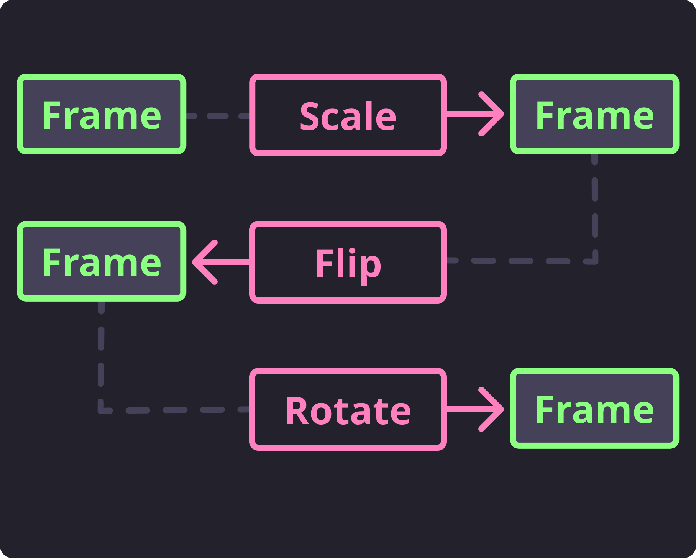

.. _OpenCV: https://docs.opencv.org/3.4/modules.html

Transforming Frames
===================

Before we get to actually detecting faces, it would benefit us to know what kind of
bottlenecks we will hit and how we can avoid or reduce them.

The obvious bottleneck any kind of object detection is that the more pixels you have to
process, the longer object detection takes.
To reduce this we typically want to scale down large frames so that we don't waste so
much time looking through all the available pixels.
This scaling operation is provided as a transformation function
:func:`~.transform.scale`.

.. code-block:: python
   :linenos:

   from facelift.capture import iter_stream_frames
   from facelift.transform import scale

   for frame in iter_stream_frames():
       assert frame.shape[0] == 128
       frame = scale(frame, 0.5)
       assert frame.shape[0] == 64

By scaling down the frame to a more reasonable size, feature detection will be able to
perform much quicker as we have less pixels to run through.
This is just one example of how we can reduce bottlenecks to benefit feature detection.
However, there are many more transformations that we *might* need to do to benefit
``dlib``'s frontal face detector.

For example, what if we are processing a video shot in portrait but we are reading in
frames in landscape?
We will probably need to rotate the frame to be in portrait mode so that the faces we
are trying to detect are positioned top-down in the frame instead of left-right.
We can also do this using a provided transformation :func:`~.transform.rotate`.

Let's say we want to rotate these frames -90 degrees:

.. code-block:: python
   :linenos:

   from facelift.capture import iter_stream_frames
   from facelift.transform import rotate

   for frame in iter_stream_frames():
       frame = rotate(frame, -90)

For a full list of the available transformations we supply, I recommend you look
through the :mod:`~.transform` module's auto-built documentation.

The goal of this module is to provide the basic transformations that you may need to
optimize face detection using our methods.
You may run into a use case where you need something we do not provide in this module.
In this case, you likely can find what you need already built into OpenCV_.

Chaining Transforms
-------------------

   Sample Transform Flow

Each of these transforms takes a single frame, mutates it with some options, and returns
it.

.. code-block:: python
   :linenos:

   from facelift.capture import iter_stream_frames
   from facelift.transform import scale, flip, rotate
   from facelift.window import opencv_window

   with opencv_window() as window:
       for frame in iter_stream_frames():
           frame = rotate(flip(scale(frame, 0.35), x_axis=True), 90)
           window.render(frame)
