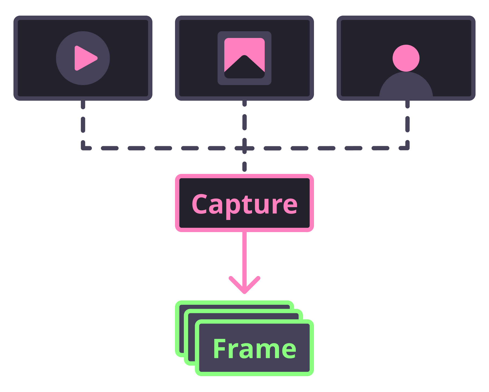

# Facelift

A simple wrapper for face feature detection and recognition.

- Easy to setup and use.
- Clean and intuitive code structure.
- Removes detection bottlenecks from the Python runtime.

---

<!--
paginate: true
-->

# Purpose

There are plenty of resources to learn how to do this with Python.
However, many solutions suffer from a handful of issues:

1. Isn't easy to use right out of the box.
2. Doesn't provide feature detection.
3. Relies on older and unmaintained processes.
4. Greedy memory usage and scattered method calls.
5. Requires a bunch of boilerplate.
6. Poor code structure.

---

# First Steps



Reading frames is the first step
Frames can be pulled from images, videos, or streams.

---

# Reading Frames

```python
from facelift.capture import iter_media_frames

for frame in iter_media_frames(Path("~/my-file.mp4")):
    print(frame)
```

---

# Contribute

Source is available on GitHub at [stephen-bunn/facelift](https://github.com/stephen-bunn/facelift).
Documentation is hosted at [facelift.rtfd.io](https://facelift.readthedocs.io).
